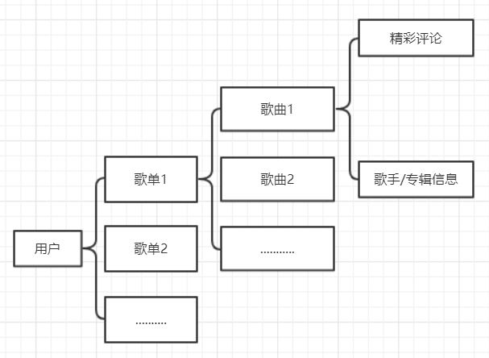

# 计算机网络课程设计 - 爬取网易云音乐热门评论

## 想法

网易云音乐是一款较为流行的听歌软件，它支持用户对某一个歌单/音乐进行评论来达到互动的功能，在知乎上“网易云音乐有哪些打动你的评论？”[^1]这个问题有几乎 1 万个回答，可以说它的评论功能已经影响到了很多网友。正因如此，我选取了这个题目作为我的爬虫课设。

## 结构分析



<center> powered by processon</center>

每一个用户都有他对应的 id，例如我在网易的用户 id 为 `37682214` 。关于这个爬虫，我的想法是：输入用户 id（默认为我自己的），爬取他的歌单并存储；爬取他每个歌单中的歌曲；爬取相应歌曲的歌手/专辑信息与精彩评论。

由于网易云音乐是动态页面，所以直接对链接 `GET` 操作得到的源代码与网页中的源代码并不相符。参考《网易云音乐新版WebAPI分析》[^2] 后实现了自己想要的功能。

## 模块介绍

### 1 获取用户歌单

链接：`http://music.163.com/api/user/playlist`

#### 参数

```json
{
  "offset": offset,
  "limit": limit,
  "uid": uid
}
```

返回结果是一个 `JSON` 序列。其格式为：

```json
{
    "subscribers":[

    ],
    "subscribed":false,
    "creator":{
        "defaultAvatar":false,
        "province":1000000,
        "authStatus":0,
        "followed":false,
        "avatarUrl":"http://p1.music.126.net/tusbGy5qbB2Twy7MvX_Glg==/109951163515462018.jpg",
        "accountStatus":0,
        "gender":1,
        "city":1010000,
        "birthday":946656000000,
        "userId":37682214,
        "userType":0,
        "nickname":"qrzbing",
        "signature":"接招吧，自然！",
        "description":"",
        "detailDescription":"",
        "avatarImgId":109951163515462018,
        "backgroundImgId":109951163419966950,
        "backgroundUrl":"http://p1.music.126.net/7ymNz_0sLSfrPCZz6puvXg==/109951163419966950.jpg",
        "authority":0,
        "mutual":false,
        "expertTags":null,
        "experts":null,
        "djStatus":0,
        "vipType":0,
        "remarkName":null,
        "avatarImgIdStr":109951163515462018,
        "backgroundImgIdStr":109951163419966950,
        "avatarImgId_str":109951163515462018
    },
    "artists":null,
    "tracks":null,
    "ordered":true,
    "status":0,
    "userId":37682214,
    "createTime":1411978318534,
    "highQuality":false,
    "subscribedCount":0,
    "cloudTrackCount":3,
    "tags":[

    ],
    "coverImgUrl":"http://p1.music.126.net/NuJ1LHZ-NohzPz5oBFnN-w==/3406287023808273.jpg",
    "updateTime":1544717510733,
    "coverImgId":3406287023808273,
    "specialType":5,
    "privacy":0,
    "newImported":false,
    "trackCount":74,
    "commentThreadId":"A_PL_0_30315000",
    "totalDuration":0,
    "anonimous":false,
    "trackUpdateTime":1544756823602,
    "playCount":3173,
    "description":null,
    "trackNumberUpdateTime":1544717510733,
    "adType":0,
    "name":"qrzbing喜欢的音乐",
    "id":30315000
}
```

不过在这里我们不用处理太多，直接用正则匹配出自己想要的数据即可。

我在这里匹配出的数据主要有：

```json
{
    "name":"name",
    "id":id
}
```

一个是歌单名称，另一个是歌单的 `id`，在匹配歌单的时候使用。

相关代码为：

```python
def get_songlists_list(limit, user_id):
    playlist_id = []
    playlist_name = []
    user_url = 'http://music.163.com/api/user/playlist?offset=0&limit={}&uid={}'.format(limit, user_id)
    r = session.get(user_url, headers=headers)
    playlist_id.extend(re.findall(r'"id":(\d+?)}', r.text))
    playlist_name.extend(re.findall(r'"name":(.+?),"', r.text))
    return playlist_name, playlist_id
```

返回值为歌单的名字与 `id`。

### 2 获取每个歌单中的音乐相关数据

对于单个歌单而言，我们通过 `GET` 其链接请求可以获得相关的歌曲数据（即不需要 API ），但是为了获得相应的评论信息，我们需要获得它的评论 API。由于对于歌单的API(http://music.163.com/api/playlist/detail)匹配歌曲名稍显繁杂，我先用(http://music.163.com/playlist)获取歌曲名称，再用 API 获取评论区 ID。

链接：http://music.163.com/api/playlist/detail

参数：

```json
{
    "id":id
}
```

由于我们最终的结果是获取歌曲中的热门评论，因此我们也不需要关心太多的内容。

所需数据：

```json
{
    "songs":[
        {
            "name":"name",
            "commentThreadId":"commentThreadId"
        }
    ]
}
```

由于返回的字符串中其实包含了歌曲和歌单的相关信息，所以提取起来会稍有难度。

```python
def get_songs_list(playlist_id):
    song_name = []
    comment_id = []     # 所有歌单的 comment id
    for i in playlist_id:
        # add song titles
        r = requests.get(
            'http://music.163.com/playlist?id={}'.format(i), headers=headers)
        song_titles = re.findall(
            r'song\?id=\d+?">(.+?)</a>', r.text.replace('\xa0', ' '))
        song_name.append(song_titles)
        # add comment id
        r = requests.get(
            'http://music.163.com/api/playlist/detail?id={}'.format(i),
            headers=headers)
        commentThread = re.findall(r'R_SO_4_(\d+?)"', r.text)
        comment_id.append(commentThread)    # 单个歌单的 comment id
        # FIXME: delete break to get all playlist
        break
    return song_name, comment_id
```

### 3 获取评论模块

评论API

`(http://music.163.com/api/v1/resource/comments/R_SO_4_{}.format)`

```python
def get_songs_comments(comment_id):
    comment_str = []
    for i in comment_id:    # 单个歌单的 id
        single_comment_list = []
        for j in i:         # 每首歌的 id
            url = 'http://music.163.com/api/v1/resource/comments/R_SO_4_{}'.format(j)
            r = requests.get(url, headers=headers)
            hot_comment_list = re.findall(r'hotComments(.+?)comments', r.text)
            hot_comment = ''.join(hot_comment_list)
            hot_comment_list = re.findall(r'"content":"(.+?)"', hot_comment)
            # FIXME: delete break to get all comments
            single_comment_list.append(hot_comment_list)
            break
        comment_str.append(single_comment_list)
        break
    return comment_str
```

这里面有点小问题，因为有的评论是回复他人的，我的正则模式匹配的并不友好，未来要用 python 中相关的 `json` 模块进行重构。

### 4 输出模块

单纯的输出

```python
def output_information(playlist_name, song_name, comments_str):
    for i in range(len(playlist_name)):
        print("playlist: "+playlist_name[i])
        for j in range(len(song_name[i])):
            print("song name: "+song_name[i][j])
            for k in comments_str[i][j]:
                print(k+"\n")
            # FIXME: delete break to output all comments
            break
        break
```

### 5 主函数

```python
if __name__ == '__main__':
    user_id = "37682214"

    playlist_name, playlist_id = get_songlists_list(60, user_id)
    if len(playlist_id)!=len(playlist_name):
        print("len(playlist_id)!=len(playlist_name) error")
        print("len(playlist_id): "+str(len(playlist_id)))
        print("len(playlist_name): "+str(len(playlist_name)))
        exit(0)
    song_name, comment_id = get_songs_list(playlist_id)
    comments_str = get_songs_comments(comment_id)
    output_information(playlist_name, song_name, comments_str)
```

## 其他

### 测试效果

只测试了第一首歌，效果：

```
playlist: qrzbing喜欢的音乐
song name: The Father's Heart
听着这支后摇傻笑了一个上午。我也不知有什么好乐的，就是觉得开心。生活嘛，一定会有好事发生。要等[可爱]

听着这歌，看到歌名，想起来我三年前去世的爸爸，对我的打击很重，以至于我三年基本没笑，没多说过话，现在听到了这首歌，想起我爸以前背着我妈给我买游戏机，和我一起玩手柄游戏，然后教我怎么放大招，也曾告诉我，别人有的，他会给我，别人没有的，他也会给我，(′；ω；`)可是我想要你

买票，一路塞着耳机到高铁站，取票，过安检，排队，面对着冷风看着车刺眼的光开进站，不由得收紧领口，我想家了

五一瞒着家人偷偷坐八个小时的车回来，到达家乡已经是凌晨五点，吃完早餐就回家，在离家两百米的地方下车，双手握紧背包带，踏着温柔的晨光，一边傻笑一边朝着家的方向奔去。那一段短短的路程，是一辈子都忘不了的开心。

拿来做学院的宣传片bgm了

一天半单曲循环了114次

I am my papa's heart.

评论多与少一点也不重要，刷屏更不重要，重要的是你喜不喜欢这首歌，反正我是爱死这首歌了

KTV必点

哪家KTV能有纯音乐??

好的后摇就想一幅优美的风景画…

感觉一切都会明朗的

爱土嗨，也爱后摇

一切的的不如意终究都会过去，心中有信念相信明天会更好

谁说后摇消极，听的劳资一口气搬八块砖[大哭]

已经在蛋糕店里徘徊了两个小时，店员过来让我走，我不走。就这样我们起了冲突，他一气之下把蛋糕扔在我脸上，我在心里默默地对自己说了句：生日快乐。
```

### 未来

使用 `json` 库重构；使用新 API [^3]

## 关于

[^1]: https://www.zhihu.com/question/57466330
[^2]: http://qianzewei.com/2015/12/10/%E7%BD%91%E6%98%93%E4%BA%91%E9%9F%B3%E4%B9%90api%E6%95%B4%E7%90%86/
[^3]: https://github.com/darknessomi/musicbox/wiki/%E7%BD%91%E6%98%93%E4%BA%91%E9%9F%B3%E4%B9%90%E6%96%B0%E7%89%88WebAPI%E5%88%86%E6%9E%90%E3%80%82